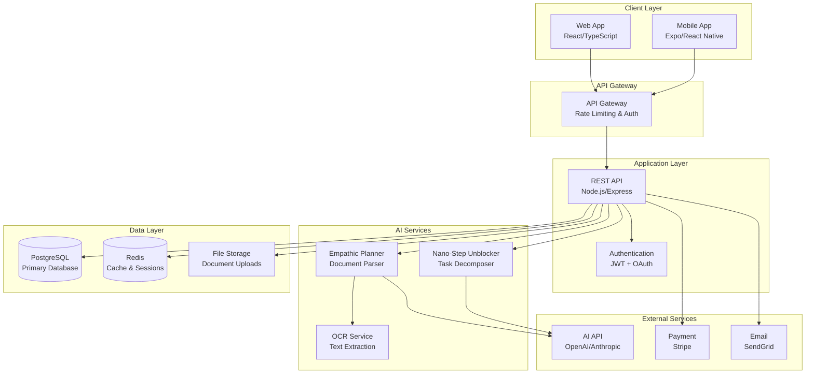
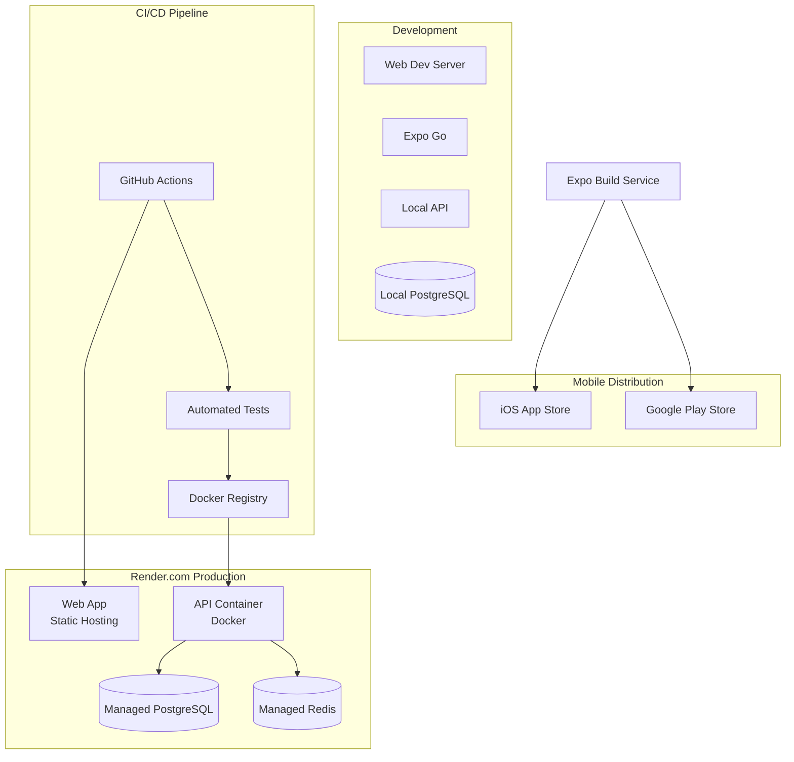

# Design Document: SpurTalk Core

## Overview

SpurTalk is a procrastination-friendly project management application built on the "Anti-Guilt" standard. The system transforms traditional productivity tools into empathetic, neurodivergent-friendly interfaces that reduce anxiety and decision paralysis. The architecture emphasizes psychological safety through calming design, intelligent task decomposition, and persistent progress visualization.

The application consists of a unified backend API serving both a responsive web application and an Expo-based mobile app. The core innovation lies in AI-powered empathic planning and nano-step task decomposition, designed to lower barriers to task initiation while maintaining user motivation through positive reinforcement.

## Architecture

### System Architecture



### Deployment Architecture



## Components and Interfaces

### UI Stack and Design System

#### Senior UI Architecture Principles
**Implementation Philosophy**:
- **Architectural Integrity**: Robust, modular, reusable solutions over temporary patches
- **Fail Fast & Explicitly**: Expose configuration errors early for easier maintenance
- **Strict TypeScript**: Enforce `strict` mode for all interfaces, props, and state
- **Reuse & Modularize**: Aggressively leverage existing components and APIs

**Design System Architecture**:
- **Design Tokens as Source of Truth**: All visual properties as semantic variables
- **Dynamic Theming**: Runtime switching support (Light/Dark modes)
- **4pt Base Spacing Grid**: Strict adherence to 4, 8, 12, 16, 24, 32pt increments
- **Typography Hierarchy**: Headers (24–32pt), Subheaders (18–22pt), Body (14–16pt), Captions (12–14pt)

**Accessibility & Inclusivity**:
- **WCAG AA Compliance**: 4.5:1 minimum contrast ratios
- **Semantic Structure**: Proper HTML tags and ARIA roles
- **44x44pt Touch Targets**: Minimum interactive element size
- **Information Redundancy**: Color + icons/text for status communication

#### Web Application UI Stack
**Framework**: Next.js 14+ (App Router) with TypeScript
**Styling**: Tailwind CSS 3.4+ with CSS Variables for design tokens
**Component Library**: Shadcn/ui + Radix UI (Headless accessibility primitives)
**State Management**: Zustand (Global) + TanStack Query (Server State)
**Testing**: Jest + React Testing Library
**Animations**: Framer Motion for smooth transitions

**Design Token Architecture**:
```typescript
// Semantic design tokens following UI architect principles
interface DesignTokens {
  colors: {
    // Psychological safety palette mapped to semantic tokens
    surface: {
      primary: 'var(--color-cream-100)',    // Primary background
      secondary: 'var(--color-cream-200)',  // Secondary background
      elevated: 'var(--color-cream-50)'     // Elevated surfaces
    },
    text: {
      primary: 'var(--color-sage-700)',     // Primary text
      secondary: 'var(--color-sage-500)',   // Secondary text
      accent: 'var(--color-lavender-600)'   // Accent text
    },
    action: {
      primary: 'var(--color-teal-500)',     // Primary actions
      hover: 'var(--color-teal-600)',       // Hover states
      disabled: 'var(--color-sage-300)'     // Disabled states
    }
  },
  spacing: {
    1: '4px',   // 4pt base
    2: '8px',   // 8pt
    3: '12px',  // 12pt
    4: '16px',  // 16pt
    6: '24px',  // 24pt
    8: '32px'   // 32pt
  },
  radius: {
    sm: '4px',
    md: '8px',
    lg: '12px',
    xl: '16px'
  }
}
```

#### Mobile Application UI Stack
**Framework**: Expo (React Native) with TypeScript
**Styling**: StyleSheet with shared design tokens via useTheme() hook
**Component Library**: React Native Elements + Custom native components
**Navigation**: React Navigation 6 with custom psychological safety transitions
**Animations**: React Native Reanimated 3 for 60fps performance
**Gestures**: React Native Gesture Handler for native interactions

**Cross-Platform Best Practices**:
- **Stable References**: useRef for mutable values (Animation objects)
- **Optimized Event Handlers**: useCallback for stable function identity
- **Safe Animation Management**: Cleanup listeners in useEffect return
- **Hook-based Theming**: Separate theming from layout for dynamic switching

#### Shared Design System
**Color Palette** (Psychological Safety Colors following 70/20/10 distribution):
```typescript
interface PsychologicalSafetyColors {
  // 70% Neutral tones (backgrounds, text) - Psychological Safety Priority
  neutral: {
    cream: {
      50: '#fefefe',   // Softest background (never stark white)
      100: '#faf9f7',  // Primary background (70% usage)
      200: '#f5f4f1'   // Secondary background
    },
    sage: {
      300: '#a7c4a0',  // Disabled states
      500: '#10b981',  // Secondary text
      700: '#047857'   // Primary text (70% usage)
    }
  },
  // 20% Primary brand colors (actions) - Calming Teal Focus
  primary: {
    teal: {
      500: '#14b8a6',  // Primary actions (20% usage)
      600: '#0f766e',  // Hover states
      700: '#0d5d56'   // Active states
    }
  },
  // 10% Accent colors (highlights) - NO ALARMIST RED
  accent: {
    lavender: {
      500: '#8b7cf6',  // Accent highlights (10% usage)
      600: '#7c3aed',  // Accent hover
      700: '#6d28d9'   // Accent active
    },
    sand: {
      500: '#f59e0b',  // Warning/attention (replaces red)
      600: '#d97706'   // Warning hover
    }
  },
  // FORBIDDEN: No red colors (#FF0000, #DC2626, etc.)
  // FORBIDDEN: No stark white (#FFFFFF) backgrounds
}
```

**Typography Scale** (Following UI architect hierarchy):
```typescript
interface TypographyScale {
  // Headers (24-32pt)
  h1: { fontSize: '32px', lineHeight: '40px', fontWeight: '600' },
  h2: { fontSize: '28px', lineHeight: '36px', fontWeight: '600' },
  h3: { fontSize: '24px', lineHeight: '32px', fontWeight: '600' },
  
  // Subheaders (18-22pt)  
  subheader: { fontSize: '20px', lineHeight: '28px', fontWeight: '500' },
  
  // Body (14-16pt)
  body: { fontSize: '16px', lineHeight: '24px', fontWeight: '400' },
  bodySmall: { fontSize: '14px', lineHeight: '20px', fontWeight: '400' },
  
  // Captions (12-14pt)
  caption: { fontSize: '12px', lineHeight: '16px', fontWeight: '400' }
}
```

**Animation Principles** (Enhanced with UI architect standards):
- **Easing**: Custom bezier curves for organic, calming motion
- **Duration**: 200-300ms micro-interactions, 400-600ms transitions
- **Spring Physics**: Gentle bounce for playful but not overwhelming feedback
- **Native Driver**: Always use native driver where applicable for 60fps
- **Cleanup**: Always stop animations in useEffect cleanup

**Quality Assurance Standards**:
- **Token Audit**: Scan for hardcoded hex values (regex: `#[0-9A-Fa-f]{6}`)
- **Theme Validation**: Test Light/Dark mode switching
- **Performance Check**: Verify listener cleanup and render optimization
- **Console Hygiene**: Wrap logging in `if (__DEV__)` checks

#### Development Workflow (Senior UI Architect Standards)

**Step 1: Verification & Style Guide**
Before implementing complex UI changes, establish a "source of truth":
1. **Create Style Guide**: Build reference page demonstrating typography, buttons, color tokens
2. **Visual Proofing**: Render examples in Light/Dark modes for contrast verification  
3. **Context Analysis**: Ensure consistency - "Does this button match our established primary action style?"

**Step 2: Implementation (The "Happy Path")**
1. **Define Tokens**: Map hex values to semantic names (`theme.colors.surface` not `#FFFFFF`)
2. **Scaffold Layout**: Build structure using 4pt grid system
3. **Apply Logic**: Hook up state/events with strict TypeScript typing
4. **Accessibility Pass**: Add `accessibilityLabel`, `role`, and focus states

**Step 3: Quality Assurance & Refinement**
- **Token Audit**: Scan for hardcoded hex values (regex: `#[0-9A-Fa-f]{6}`)
- **Theme Validation**: Toggle themes to ensure no "flash of wrong theme"
- **Performance Check**: Verify listener cleanup and render optimization
- **Console Hygiene**: Wrap logging in `if (__DEV__)` checks

**Documentation Protocols**:
- **Contextual Journaling**: Update `.context/journal.md` with architectural decisions
- **Color Mapping Guide**: Maintain `.context/color-mapping-guide.md` explaining functional intent

**Expert Guidance Integration**:
- **Timing Issues**: Implement `waitForElement` utility using `requestAnimationFrame`
- **Color Schemes**: Define as semantic design tokens, verify 70/20/10 balance and accessibility
- **Animation Performance**: Use native driver, store Animated values in `useRef`, ensure cleanup

### Technology Stack Summary

**Complete Web Stack**:
- **Framework**: Next.js 14+ (App Router)
- **Styling**: Tailwind CSS 3.4+ with CSS Variables
- **Components**: Shadcn/ui + Radix UI
- **State**: Zustand (Global) + TanStack Query (Server)
- **Testing**: Jest + React Testing Library
- **Animations**: Framer Motion
- **Typography**: Inter font family (rounded characteristics)

**Complete Mobile Stack**:
- **Framework**: Expo (React Native) with TypeScript
- **Styling**: StyleSheet with shared design tokens via useTheme()
- **Components**: React Native Elements + Custom native components
- **Navigation**: React Navigation 6
- **Animations**: React Native Reanimated 3 (60fps)
- **Gestures**: React Native Gesture Handler
- **State**: Shared Zustand store with web application

### Core Components

#### 1. Empathic Planner
**Purpose**: AI-powered document parsing and timeline generation with psychological safety principles.

**Key Features**:
- Multi-format document parsing (PDF, images, text)
- OCR text extraction with layout preservation
- Date and deadline extraction
- Automatic buffer day insertion
- Stress cluster detection
- Encouraging milestone labeling

**Interface**:
```typescript
interface EmpathicPlanner {
  parseDocument(file: File, userId: string): Promise<ParsedDocument>
  generateTimeline(tasks: Task[], constraints: TimelineConstraints): Promise<Timeline>
  insertBufferDays(timeline: Timeline): Timeline
  detectStressClusters(timeline: Timeline): StressCluster[]
}

interface ParsedDocument {
  extractedText: string
  detectedDates: Date[]
  suggestedTasks: Task[]
  documentType: 'syllabus' | 'email' | 'project_brief' | 'other'
  confidence: number
}
```

#### 2. Nano-Step Unblocker
**Purpose**: Task decomposition system that breaks down overwhelming tasks into micro-steps.

**Key Features**:
- Automatic stall detection (24-hour timeout)
- Manual activation via "I'm Stuck" button
- First step must be <2 minutes and zero emotional effort
- 3-5 step decomposition limit
- Cinema mode presentation

**Interface**:
```typescript
interface NanoStepUnblocker {
  detectStall(task: Task): boolean
  decomposeTask(task: Task): Promise<NanoStep[]>
  validateFirstStep(step: NanoStep): boolean
}

interface NanoStep {
  id: string
  text: string
  estimatedSeconds: number
  emotionalEffort: 'zero' | 'minimal'
  isCompleted: boolean
  parentTaskId: string
}
```

#### 3. Focus Deck
**Purpose**: Card-based task interface that eliminates decision paralysis through single-task presentation.

**Key Features**:
- Tinder-style swipe interactions
- Smooth animations using React Native Reanimated
- Three swipe directions: right (do now), left (not now), down (break down)
- Card stack visualization with depth

**Interface**:
```typescript
interface FocusDeck {
  getCurrentCard(): Task | null
  swipeRight(taskId: string): Promise<void> // Enter focus mode
  swipeLeft(taskId: string): Promise<void>  // Move to bottom
  swipeDown(taskId: string): Promise<void>  // Trigger unblocker
  getNextCard(): Task | null
}
```

#### 4. River Timeline
**Purpose**: Vertical flowing timeline that reduces overwhelm through progressive disclosure.

**Key Features**:
- Immediate tasks rendered clearly
- Future tasks blurred/misty
- Missed deadlines flow around (no red coloring)
- Logical task sequencing
- Smooth scrolling animations

**Interface**:
```typescript
interface RiverTimeline {
  renderTimeline(tasks: Task[]): TimelineElement[]
  applyBlurEffect(task: Task, distance: number): RenderStyle
  handleMissedDeadline(task: Task): void
  calculateTaskPosition(task: Task): Position
}
```

#### 5. Garden Progress
**Purpose**: Persistent visual representation of completed tasks to maintain motivation.

**Key Features**:
- Tiny tasks → flowers
- Big tasks → trees  
- Streaks → sun brightness
- Permanent visual elements
- Footer accessibility

**Interface**:
```typescript
interface GardenProgress {
  addFlower(task: Task): GardenElement
  addTree(task: Task): GardenElement
  updateSunBrightness(streak: number): void
  renderGarden(): GardenScene
  persistElement(element: GardenElement): void
}
```

### API Endpoints

#### Authentication & User Management
```
POST   /api/auth/register
POST   /api/auth/login
POST   /api/auth/refresh
DELETE /api/auth/logout
GET    /api/user/profile
PUT    /api/user/profile
DELETE /api/user/account
GET    /api/user/export-data
```

#### Task Management
```
GET    /api/tasks
POST   /api/tasks
PUT    /api/tasks/:id
DELETE /api/tasks/:id
POST   /api/tasks/:id/complete
POST   /api/tasks/:id/decompose
GET    /api/tasks/deck
POST   /api/tasks/deck/swipe
```

#### Document Processing
```
POST   /api/documents/upload
POST   /api/documents/parse
GET    /api/documents/:id/status
GET    /api/documents/:id/results
```

#### Timeline & Planning
```
GET    /api/timeline
POST   /api/timeline/generate
PUT    /api/timeline/update
GET    /api/timeline/river-view
```

#### Progress & Garden
```
GET    /api/progress/garden
GET    /api/progress/stats
POST   /api/progress/celebrate
```

## Data Models

### Core Data Schema

```typescript
interface User {
  id: string
  email: string
  passwordHash: string
  createdAt: Date
  updatedAt: Date
  preferences: UserPreferences
  subscription: Subscription
  gardenState: GardenState
}

interface UserPreferences {
  stallDetectionTimeout: number // hours
  colorPalette: 'default' | 'high_contrast'
  fuzzyDeadlineLabels: FuzzyDeadlineConfig
  notificationSettings: NotificationConfig
  timezone: string
}

interface Task {
  id: string
  userId: string
  title: string
  description?: string
  
  // Effort and emotional context
  effortLevel: 'Tiny' | 'Small' | 'Medium' | 'Big'
  emotionalTag?: 'Boring' | 'Scary' | 'Fun'
  
  // Deadline management
  fuzzyDeadline: 'Soon' | 'This Week' | 'Eventually'
  hardDeadline: Date
  
  // Motivation engine
  compellingEvent?: string
  motivationCategory?: 'Relief' | 'Energy' | 'Achievement' | 'Identity'
  
  // Task state
  state: 'Deck' | 'River' | 'Garden' | 'Stalled' | 'Active' | 'Completed'
  nanoSteps: NanoStep[]
  
  // Metadata
  createdAt: Date
  updatedAt: Date
  completedAt?: Date
  stallDetectedAt?: Date
  
  // Relationships
  parentTaskId?: string
  dependencies: string[]
  tags: string[]
}

interface Timeline {
  id: string
  userId: string
  tasks: TimelineTask[]
  bufferDays: BufferDay[]
  stressClusters: StressCluster[]
  generatedAt: Date
  lastModified: Date
}

interface TimelineTask {
  taskId: string
  position: number
  renderStyle: 'clear' | 'blurred' | 'misty'
  scheduledDate: Date
  dependencies: string[]
}

interface GardenState {
  userId: string
  elements: GardenElement[]
  sunBrightness: number
  currentStreak: number
  longestStreak: number
  totalFlowers: number
  totalTrees: number
  lastUpdated: Date
}

interface GardenElement {
  id: string
  type: 'flower' | 'tree' | 'sun'
  position: { x: number; y: number }
  size: number
  color: string
  taskId: string
  createdAt: Date
}

interface Document {
  id: string
  userId: string
  filename: string
  fileType: string
  fileSize: number
  uploadedAt: Date
  processingStatus: 'pending' | 'processing' | 'completed' | 'failed'
  extractedText?: string
  parsedTasks?: Task[]
  confidence?: number
}
```

### Database Schema (PostgreSQL)

```sql
-- Users table
CREATE TABLE users (
  id UUID PRIMARY KEY DEFAULT gen_random_uuid(),
  email VARCHAR(255) UNIQUE NOT NULL,
  password_hash VARCHAR(255) NOT NULL,
  created_at TIMESTAMP DEFAULT NOW(),
  updated_at TIMESTAMP DEFAULT NOW(),
  preferences JSONB DEFAULT '{}',
  subscription JSONB DEFAULT '{}',
  garden_state JSONB DEFAULT '{}'
);

-- Tasks table
CREATE TABLE tasks (
  id UUID PRIMARY KEY DEFAULT gen_random_uuid(),
  user_id UUID REFERENCES users(id) ON DELETE CASCADE,
  title VARCHAR(500) NOT NULL,
  description TEXT,
  effort_level VARCHAR(20) CHECK (effort_level IN ('Tiny', 'Small', 'Medium', 'Big')),
  emotional_tag VARCHAR(20) CHECK (emotional_tag IN ('Boring', 'Scary', 'Fun')),
  fuzzy_deadline VARCHAR(20) CHECK (fuzzy_deadline IN ('Soon', 'This Week', 'Eventually')),
  hard_deadline TIMESTAMP,
  compelling_event TEXT,
  motivation_category VARCHAR(20) CHECK (motivation_category IN ('Relief', 'Energy', 'Achievement', 'Identity')),
  state VARCHAR(20) DEFAULT 'Deck' CHECK (state IN ('Deck', 'River', 'Garden', 'Stalled', 'Active', 'Completed')),
  nano_steps JSONB DEFAULT '[]',
  created_at TIMESTAMP DEFAULT NOW(),
  updated_at TIMESTAMP DEFAULT NOW(),
  completed_at TIMESTAMP,
  stall_detected_at TIMESTAMP,
  parent_task_id UUID REFERENCES tasks(id),
  dependencies JSONB DEFAULT '[]',
  tags JSONB DEFAULT '[]'
);

-- Documents table
CREATE TABLE documents (
  id UUID PRIMARY KEY DEFAULT gen_random_uuid(),
  user_id UUID REFERENCES users(id) ON DELETE CASCADE,
  filename VARCHAR(255) NOT NULL,
  file_type VARCHAR(50) NOT NULL,
  file_size INTEGER NOT NULL,
  uploaded_at TIMESTAMP DEFAULT NOW(),
  processing_status VARCHAR(20) DEFAULT 'pending',
  extracted_text TEXT,
  parsed_tasks JSONB DEFAULT '[]',
  confidence DECIMAL(3,2)
);

-- Timelines table
CREATE TABLE timelines (
  id UUID PRIMARY KEY DEFAULT gen_random_uuid(),
  user_id UUID REFERENCES users(id) ON DELETE CASCADE,
  tasks JSONB NOT NULL DEFAULT '[]',
  buffer_days JSONB DEFAULT '[]',
  stress_clusters JSONB DEFAULT '[]',
  generated_at TIMESTAMP DEFAULT NOW(),
  last_modified TIMESTAMP DEFAULT NOW()
);

-- Indexes for performance
CREATE INDEX idx_tasks_user_id ON tasks(user_id);
CREATE INDEX idx_tasks_state ON tasks(state);
CREATE INDEX idx_tasks_hard_deadline ON tasks(hard_deadline);
CREATE INDEX idx_documents_user_id ON documents(user_id);
CREATE INDEX idx_documents_status ON documents(processing_status);
CREATE INDEX idx_timelines_user_id ON timelines(user_id);
```

## Correctness Properties

*A property is a characteristic or behavior that should hold true across all valid executions of a system—essentially, a formal statement about what the system should do. Properties serve as the bridge between human-readable specifications and machine-verifiable correctness guarantees.*

### Property 1: Document Processing Round Trip
*For any* uploaded document containing structured task information, parsing then regenerating the timeline should preserve all essential task data and deadlines
**Validates: Requirements 1.1, 1.2, 1.3, 8.1**

### Property 2: Psychological Safety Color Compliance
*For any* UI element rendered in the system, all colors used should fall within the approved psychological safety palette (deep lavenders, sage greens, warm sand, teals) and never include red or stark white
**Validates: Requirements 2.1, 2.2, 2.3, 3.4**

### Property 3: Empathic Timeline Generation
*For any* set of tasks with deadlines, the empathic planner should identify high-stress periods and automatically insert buffer days before major deadlines
**Validates: Requirements 1.4, 1.5, 8.2**

### Property 4: Encouraging Language Consistency
*For any* user-facing text generated by the system, the language should maintain warm, encouraging tone and never contain forbidden alarmist terms ("Overdue", "Late", "Urgent")
**Validates: Requirements 2.5, 2.6, 8.3**

### Property 5: River Timeline Visual Hierarchy
*For any* timeline view, immediate tasks should have higher visual prominence (opacity, size) than future tasks, which should be progressively blurred based on temporal distance
**Validates: Requirements 3.1, 3.2, 3.3**

### Property 6: Task Dependency Sequencing
*For any* set of tasks with dependencies, the timeline should sequence them logically such that prerequisite tasks always appear before dependent tasks
**Validates: Requirements 3.5**

### Property 7: Stall Detection and Response
*For any* task that remains in "Active" state beyond the timeout threshold or receives manual stall signals, the nano-step unblocker should activate and generate 3-5 decomposed steps
**Validates: Requirements 4.1, 4.2, 4.3**

### Property 8: First Step Barrier Minimization
*For any* task decomposed by the nano-step unblocker, the first step should require less than 2 minutes and zero emotional effort to complete
**Validates: Requirements 4.4, 8.4, 8.5**

### Property 9: Cinema Mode Activation
*For any* nano-step presentation, the system should activate cinema mode with screen dimming and single-step focus
**Validates: Requirements 4.5**

### Property 10: Focus Deck Card Interaction
*For any* swipe gesture on a task card, the system should respond appropriately: right swipe enters focus mode, left swipe moves to bottom, down swipe triggers decomposition
**Validates: Requirements 5.1, 5.2, 5.3, 5.4**

### Property 11: Smooth Animation Performance
*For any* swipe gesture or UI transition, animations should maintain 60fps performance and smooth visual feedback
**Validates: Requirements 5.5**

### Property 12: Garden Element Generation
*For any* completed task, the system should generate appropriate garden elements: flowers for tiny tasks, trees for big tasks, and update sun brightness for streaks
**Validates: Requirements 6.1, 6.2, 6.3**

### Property 13: Garden Persistence and Accessibility
*For any* garden element created, it should persist permanently across sessions and be accessible from all screens via footer navigation
**Validates: Requirements 6.4, 6.5**

### Property 14: Task Metadata Assignment
*For any* created task, the system should assign appropriate effort level, emotional tags where applicable, and motivation categorization
**Validates: Requirements 7.1, 7.2, 7.4, 7.5**

### Property 15: Fuzzy Deadline Management
*For any* task with a deadline, the system should display fuzzy labels to users while maintaining precise hard deadlines in the data layer
**Validates: Requirements 7.3**

## Error Handling

### Error Categories and Strategies

#### 1. Document Processing Errors
**OCR Failures**: When text extraction fails, provide graceful fallback with manual text input option
**Parsing Errors**: When AI parsing fails, allow manual task creation with extracted text as reference
**File Format Errors**: Validate file types before processing, provide clear error messages for unsupported formats

#### 2. AI Service Errors
**API Timeouts**: Implement exponential backoff with circuit breaker pattern
**Rate Limiting**: Queue requests and provide user feedback about processing delays
**Service Unavailability**: Provide offline mode with basic task management functionality

#### 3. Data Consistency Errors
**Sync Conflicts**: Use last-write-wins with conflict detection and user notification
**Database Errors**: Implement transaction rollback with user-friendly error messages
**Cache Invalidation**: Automatic cache refresh with optimistic updates

#### 4. UI/UX Error Handling
**Network Errors**: Show offline indicator with queued action status
**Animation Failures**: Fallback to simple transitions without breaking functionality
**Gesture Recognition Errors**: Provide alternative button-based interactions

### Error Recovery Patterns

```typescript
interface ErrorHandler {
  handleDocumentError(error: DocumentError): RecoveryAction
  handleAIServiceError(error: AIServiceError): RecoveryAction  
  handleDataError(error: DataError): RecoveryAction
  handleUIError(error: UIError): RecoveryAction
}

type RecoveryAction = 
  | { type: 'retry', maxAttempts: number }
  | { type: 'fallback', alternativeAction: string }
  | { type: 'graceful_degradation', reducedFunctionality: string[] }
  | { type: 'user_intervention', message: string }
```

## Testing Strategy

### Dual Testing Approach

The testing strategy employs both unit testing and property-based testing as complementary approaches:

- **Unit Tests**: Verify specific examples, edge cases, and error conditions
- **Property Tests**: Verify universal properties across all inputs using randomized test data
- **Integration Tests**: Verify component interactions and API contracts
- **End-to-End Tests**: Verify critical user journeys across web and mobile platforms

### Property-Based Testing Configuration

**Framework**: fast-check for JavaScript/TypeScript property-based testing
**Test Iterations**: Minimum 100 iterations per property test
**Test Tagging**: Each property test references its design document property

Example property test structure:
```typescript
// Feature: spur-talk-core, Property 1: Document Processing Round Trip
fc.assert(fc.property(
  fc.record({
    tasks: fc.array(taskGenerator),
    deadlines: fc.array(dateGenerator)
  }),
  (document) => {
    const parsed = empathicPlanner.parseDocument(document)
    const regenerated = empathicPlanner.generateTimeline(parsed.tasks)
    return preservesEssentialData(document, regenerated)
  }
), { numRuns: 100 })
```

### Unit Testing Focus Areas

**Specific Examples**:
- Document parsing with known syllabus formats
- Task decomposition with predefined complex tasks
- Garden element rendering with specific completion scenarios

**Edge Cases**:
- Empty document uploads
- Tasks with no deadlines
- Maximum task dependency chains
- Network connectivity loss scenarios

**Error Conditions**:
- Malformed document uploads
- AI service timeouts
- Database connection failures
- Invalid user input validation

### Testing Tools and Libraries

**Property-Based Testing**: fast-check
**Unit Testing**: Jest with React Native Testing Library
**Integration Testing**: Supertest for API testing
**End-to-End Testing**: Detox for mobile, Playwright for web
**Performance Testing**: Artillery for load testing
**Accessibility Testing**: axe-core for WCAG compliance

### Continuous Integration

**Pre-commit Hooks**: Run unit tests and linting
**Pull Request Checks**: Full test suite including property tests
**Deployment Gates**: All tests must pass before production deployment
**Performance Monitoring**: Automated performance regression detection

## Observability and Monitoring

### Three Pillars of Observability

#### 1. Metrics
**Application Metrics**:
- Request latency (p50, p95, p99)
- Throughput (requests per second)
- Error rates by endpoint
- Task completion rates
- Document processing success rates
- AI service response times

**Business Metrics**:
- User engagement (daily/monthly active users)
- Task creation and completion rates
- Document upload success rates
- Feature adoption rates
- Subscription conversion rates

**Infrastructure Metrics**:
- CPU and memory utilization
- Database connection pool usage
- Cache hit rates
- Storage usage and growth

#### 2. Structured Logging
**Log Levels and Categories**:
```typescript
interface LogEntry {
  timestamp: string
  level: 'debug' | 'info' | 'warn' | 'error' | 'fatal'
  service: string
  traceId: string
  userId?: string
  message: string
  metadata: Record<string, any>
}
```

**Critical Log Events**:
- User authentication events
- Document processing pipeline stages
- AI service interactions
- Database transaction failures
- Security events and anomalies

#### 3. Distributed Tracing
**Trace Implementation**:
- Request correlation across services
- AI processing pipeline tracing
- Database query performance tracking
- External API call monitoring
- User journey tracking

### Monitoring Stack

**Metrics Collection**: Prometheus with custom metrics
**Log Aggregation**: Structured JSON logs with correlation IDs
**Tracing**: OpenTelemetry for distributed tracing
**Alerting**: PagerDuty integration for critical issues
**Dashboards**: Grafana for operational visibility

### Alert Configuration

**Critical Alerts** (immediate response):
- API error rate > 5%
- Database connection failures
- AI service unavailability
- Payment processing failures

**Warning Alerts** (within 1 hour):
- Response time p95 > 2 seconds
- Document processing queue backlog
- Memory usage > 80%
- Disk space < 20%

## Security Architecture

### Security Layers

#### 1. Network Security
**API Gateway Security**:
- Rate limiting per user/IP
- DDoS protection
- Request size limits
- Geographic restrictions if needed

**TLS/SSL**:
- TLS 1.3 for all communications
- Certificate rotation automation
- HSTS headers
- Certificate transparency monitoring

#### 2. Authentication & Authorization
**Multi-Factor Authentication**:
- TOTP support for premium users
- SMS backup for account recovery
- Biometric authentication on mobile

**JWT Security**:
- Short-lived access tokens (15 minutes)
- Refresh token rotation
- Secure token storage
- Token revocation capability

**Role-Based Access Control**:
```typescript
interface UserRole {
  id: string
  name: 'user' | 'premium' | 'admin'
  permissions: Permission[]
}

interface Permission {
  resource: string
  actions: ('read' | 'write' | 'delete')[]
}
```

#### 3. Data Protection
**Encryption**:
- AES-256 encryption at rest
- Field-level encryption for sensitive data
- Key rotation every 90 days
- Hardware security modules for key management

**Data Classification**:
- Public: Marketing content, documentation
- Internal: System logs, metrics
- Confidential: User tasks, documents
- Restricted: Payment information, authentication data

### Security Monitoring

**Security Events**:
- Failed authentication attempts
- Privilege escalation attempts
- Unusual data access patterns
- Suspicious file uploads

**Vulnerability Management**:
- Automated dependency scanning
- Container image vulnerability scanning
- Regular penetration testing
- Bug bounty program

## Scalability and Performance

### Horizontal Scaling Strategy

#### 1. Stateless Application Design
**API Layer**:
- Stateless request handling
- Session data in Redis
- Load balancer with health checks
- Auto-scaling based on CPU/memory

#### 2. Database Scaling
**Read Replicas**:
- Read-only replicas for query distribution
- Connection pooling with PgBouncer
- Query optimization and indexing
- Automated failover mechanisms

**Caching Strategy**:
```typescript
interface CacheStrategy {
  userSessions: { ttl: '24h', storage: 'redis' }
  taskLists: { ttl: '1h', storage: 'redis' }
  documentParsing: { ttl: '7d', storage: 'redis' }
  staticAssets: { ttl: '30d', storage: 'cdn' }
}
```

#### 3. Microservices Architecture
**Service Boundaries**:
- User Management Service
- Task Management Service  
- Document Processing Service
- AI Integration Service
- Notification Service
- Billing Service

**Inter-Service Communication**:
- Synchronous: REST APIs for real-time operations
- Asynchronous: Message queues for background processing
- Event-driven: Pub/sub for loose coupling

### Performance Optimization

**Database Optimization**:
- Query optimization with EXPLAIN ANALYZE
- Proper indexing strategy
- Connection pooling
- Query result caching

**API Performance**:
- Response compression (gzip)
- API response caching
- Pagination for large datasets
- GraphQL for flexible data fetching

**Frontend Performance**:
- Code splitting and lazy loading
- Image optimization and CDN
- Service worker for offline functionality
- Bundle size optimization

## Disaster Recovery and Business Continuity

### Backup Strategy

**Database Backups**:
- Automated daily backups with 30-day retention
- Point-in-time recovery capability
- Cross-region backup replication
- Backup integrity verification

**Application Data**:
- User-uploaded documents in object storage
- Automated backup to secondary region
- Version control for configuration files
- Infrastructure as code backup

### Recovery Procedures

**Recovery Time Objectives (RTO)**:
- Critical services: < 1 hour
- Non-critical services: < 4 hours
- Full system recovery: < 8 hours

**Recovery Point Objectives (RPO)**:
- User data: < 15 minutes
- System configuration: < 1 hour
- Analytics data: < 24 hours

### Incident Response

**Incident Classification**:
- P0: Complete service outage
- P1: Major feature unavailable
- P2: Performance degradation
- P3: Minor issues

**Response Procedures**:
- Automated alerting and escalation
- Incident commander assignment
- Communication templates
- Post-incident review process

## Compliance and Governance

### Data Governance

**Data Retention Policies**:
- User data: Retained until account deletion + 30 days
- System logs: 90 days retention
- Audit logs: 7 years retention
- Backup data: 30 days retention

**Data Processing Agreements**:
- Third-party AI service agreements
- Cloud provider data processing addendums
- Vendor security assessments
- Regular compliance audits

### Regulatory Compliance

**GDPR Compliance**:
- Data protection impact assessments
- Privacy by design implementation
- Data subject rights automation
- Regular compliance training

**SOC 2 Type II**:
- Security controls documentation
- Regular third-party audits
- Control effectiveness testing
- Continuous monitoring program

Now I need to use the prework tool to analyze the acceptance criteria before writing the correctness properties:

<function_calls>
<invoke name="prework">
<parameter name="featureName">spur-talk-core